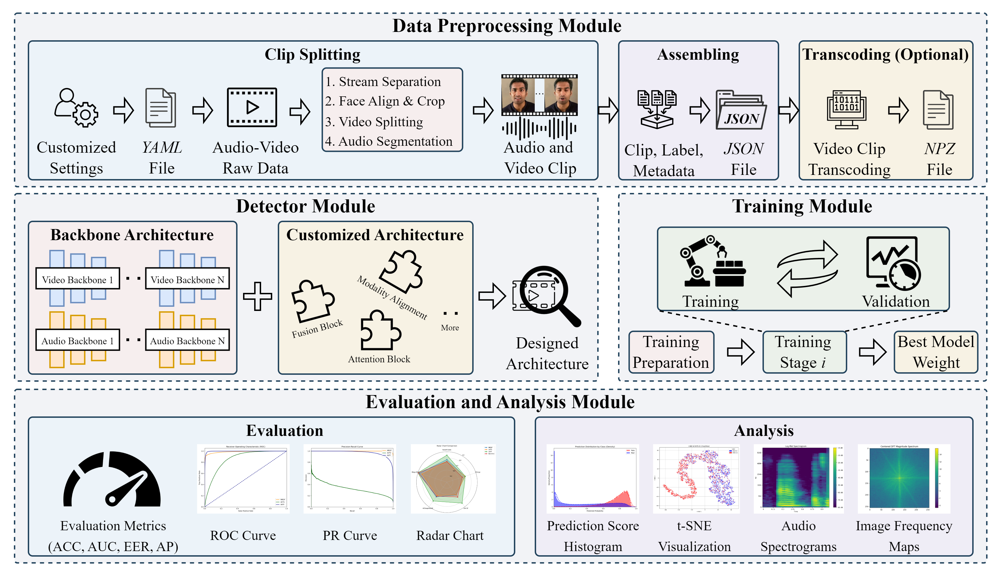

# DeepfakeBench-MM and Mega-MMDF

[](https://creativecommons.org/licenses/by-nc/4.0/)   

<b> Authors: Kangran Zhao*, Yupeng Chen*, Xiaoyu Zhang*, Yize Chen, Weinan Guan, Baicheng Chen, Chengzhe Sun, Soumyya Kanti Datta, Qingshan Liu, Siwei Lyu, Baoyuan Wu†

(*Equal contribution, †Corresponding author)

<div style="text-align:center;">
  
</div>

## Overview
This repository provides two main contributions to the multimodal Deepfake detection community:

(1) <a href="https://dataverse.harvard.edu/dataset.xhtml?persistentId=doi:10.7910/DVN/J4DVAA"> Mega-MMDF </a> Dataset — the largest publicly available multimodal Deepfake detection dataset, which be released soon.

(2) DeepfakeBench-MM — a modular and extensible benchmark codebase for training and evaluating multimodal Deepfake detection methods.


## Quick Start
### 1. Installation
<a href="#top">[Back to top]</a>
```
conda create -n DeepfakeBench python=3.7.2
conda activate DeepfakeBench
pip install -r requirements.txt
```
### 2. Data Preprocessing
<a href="#top">[Back to top]</a>

All datasets must be preprocessed to a unified format, including: (1) Audio-video stream separation; (2) Audio resampling and video frame rate adjustment; (3) Face alignment and cropping in videos; (4) Audio segmentation

After preprocessing, a JSON file is generated to organize audio/video clips with their corresponding labels and metadata.

Example command to preprocess a dataset:
```
python preprocess/fakeavceleb_preprocesor.py
```
Thanks to our modular design, additional datasets can be integrated with ease. More details can be found in preprocess/README.md.

### 3. Training
<a href="#top">[Back to top]</a>

Our benchmark provides flexible training scripts with support for various configurations, including model architecture, optimizer, batch size, number of epochs, etc.

To train a custom model:

(1) Inherit from detectors/abstract_detectors.py and implement required methods. We decouple forward() into features() and classifier() to encourage backbone reuse.

(2) Define a custom loss by inheriting from losses/abstract_loss.py.

(3) Register new backbones, models, and losses in utils/registry.py.

(4) Configure: `configs/path.yaml` for logging, dataset, and JSON directory paths. `configs/detectors/${YourModel}.yaml` for model, dataset, training, and validation settings.

(5) Start training:
```
# With out DDP:
python train.py --detector_path configs/detectors/${YourModel}.yaml

# With DDP:
python train.sh ${num_GPUs} --detector_path configs/detectors/${YourModel}.yaml
```
Optional arguments (overriding config settings).

--train_datasets: [list] training datassets, which will be concatenated together for training

--val_datsets: [list] validation datasets

--save_ckpt: [bool] argument enabled to save checkpoint every epoch

--use_transcoded: [bool] argument enabled to use the transcoded version of preprocessed data 

--log-dir: [str] customized log directory


### 4. Evaluation
<a href="#top">[Back to top]</a>

To evaluate a trained model on both in-domain and cross-domain datasets:
```
python test.py --detector_path configs/detectors/${YourModel}.yaml --weights_path ${YourWeight}.yaml
```


## 🛡️ License

<a href="#top">[Back to top]</a>


This repository is licensed by [The Chinese University of Hong Kong, Shenzhen](https://www.cuhk.edu.cn/en) under Creative Commons Attribution-NonCommercial 4.0 International Public License (identified as [CC BY-NC-4.0 in SPDX](https://spdx.org/licenses/)). More details about the license could be found in [LICENSE](./LICENSE).

This project is built by the Secure Computing Lab of Big Data (SCLBD) at The School of Data Science (SDS) of The Chinese University of Hong Kong, Shenzhen, directed by Professor [Baoyuan Wu](https://sites.google.com/site/baoyuanwu2015/home). SCLBD focuses on the research of trustworthy AI, including backdoor learning, adversarial examples, deepfake detection, etc.

If you have any suggestions, comments, or wish to contribute code or propose methods, we warmly welcome your input. Please contact us at wubaoyuan@cuhk.edu.cn or kangranzhao@link.cuhk.edu.cn. We look forward to collaborating with you in pushing the boundaries of deepfake detection.
